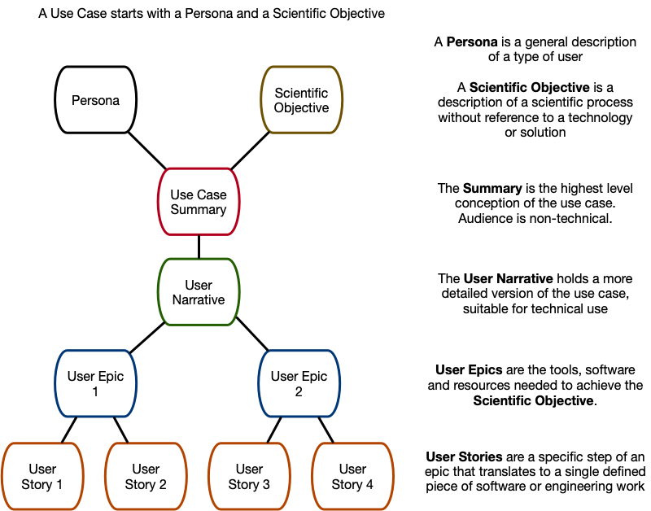
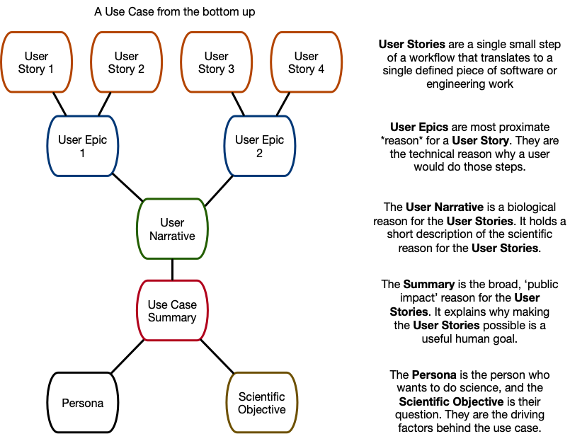

# Use Case Library Contributing Guidelines

Hello, and thank you for wanting to contribute to the DCPPC Use Case Library\!

By contributing to this repository, you agree:

1.  To obey the [Code of Conduct](./CODE_OF_CONDUCT.md)
2.  To release all your contributions under the same terms as the
    license itself: the [Creative Commons Zero](./LICENSE.md) (aka
    Public Domain) license

If you are OK with these two conditions, then we welcome both you and
your contribution\!

If you have any questions about contributing, please [open an
issue](https://github.com/dcppc/use-case-library/issues/new) and Team Copper
will lend a hand ASAP.

Thank you for being here and for being a part of the DCPPC project.

# Quick Start

To create a new summary, persona, etc.:

- Make a new branch fom [latest master](https://github.com/dcppc/use-case-library).
- Create a new SUMMARY-, PERSONA-, NARRATIVE-, USERSTORY-, or EPIC- file under library/ by copying an existing file. Make sure that the filename specifies a unique ID, e.g. SUMMARY-1-xyz yields the ID SUMMARY-1 which is not unique.
- Update the YAML metadata at the top of the file to reflect your new metadata.
- Edit the markdown description below the YAML header.
- (Optional) Build the file using snakemake, check the output. Iterate until you're happy.
- Add new file to git repo, commit, push.
- Set up a Pull Request to merge into master and tag in @ctb.
- Uncle Arche will check out a copy of your pull request and run snakemake build on it, and link to the output of the build process, so you can use Uncle Archie instead of using snakemake locally

# Overview

The Use Case Library hosts a variety of Use Cases that are relevant to the [Data Commons](https://public.nihdatacommons.us/) and maintained via our [Github Repository](https://github.com/dcppc/use-case-library)  

## File Name Conventions
For maximum flexibility, each part of a Use Case is stored in it's own markdown file. Different components of the library follow slightly different naming conventions, however they all share two characteristics:

 -  Filenames begin with the component type in ALLCAPS
 -  The component type is followed by `-<digit>` where the digit is a number that does not already occur in that component set

For Epics, Narratives, Personas, and Summaries, the digit is addionally followed by a short description of the contents of the file, where spaces are replaced with `-`

Examples:

- EPIC-1-develop-plan-for-association-testing.md
- NARRATIVE-1-topmed-genotype-phenotype.md
- PERSONA-5-data-provider.md
- SUMMARY-1-topmed-genotype-phenotype.md

For User Stories, no description is added:

- USERSTORY-6.md

The numbers included in each filename are to ensure uniqueness. There is no requirement that all numbers are used in the library or that they occur in a particular order within a Use Case.

## Usage
 | Use Case Component | Specificity | Occurances per Use Case | 
 |:--------------------:|:------------:|:-------------------------:|
 Persona | Can be used by multiple UCs | 1 |
 Scientific Objective | Can be used by a single UC | 1 |
 Summary | Can be used by a single UC | 1 |
User Narrative | Can be used by a single UC | 1 |
 User Epic | Can be used by a single UC | 1 - 10 |
 User Story | Can be used by multiple UCs | 1 - any | 
 
 
 ## Writing a Use Case
 
 A finished Use Case must be associated with a Persona, and have a Scientific Objective, a Summary, and a number of User Epics and User Stories that comprise it's User Narrative. 
 


### Personas

A Persona is a general description of a type of user. As these are general archetypes, most contributors will not need to create a new Persona. A Persona file has four parts:

 1. title: this 1 - 5 words that describe a user
 2. blurb: < 10 words that add more description
 3. tags: a carriage return seperated list of relevant 1 - 2 word descriptions
 4. A long form description of the user, detailing their strengths and weaknesses as they relate to computational science.

The sub-section of the file containing the title, blurb and tags should be bounded by `---`

Example: 

> `---`  
> `title: Biological data scientist`  
> `blurb: A researcher with some scripting skills`  
> `tags:`  
> `- biological`  
> `- data scientist`  
> `---`  
> `A bioinformatician or researcher with some scripting skills, capable of using and combining pre-established pipelines, and doing exploratory data analysis in R/RStudio or Python/Jupyter Notebook.`  

### Use Case Summary

A Summary is a high-level, non-technical description of a entire Use Case, written in third-person omniscient. The user in each summary should have a name, a problem, abd both proximate and ultimate goals. Although these are based on genearl archetypes, each Use Case will have it's own unique summary, and the user should be a relatable individual rather than a faceless abstraction. The Summary also includes multiple solutions to the users problem. 

A Summary file has seven parts:

 1. title: this 1 - 5 words that describe the summary
 2. narratives: the abbreviated file name of the narrative that is tied to this summary, formatted as a single-item list (i.e.`NARRATIVE-#`)
 3. tags: a carriage return seperated list of relevant 1 - 2 word descriptions
 4. Scenario: A long form description of a named user, including their proximate and ultimate goals, available resources, problems with reaching those goals and individual abilities.
 5. Current Approaches: A long form description of how this user might approach their problems, given current non-Data Commons technology
 6. With the Data Commons Phase I: A long form description of how this user might attain their goals more easily using Data Commons resources
 7. With Data Commons longer vision: A long form description of how this user will be able to accomplish their goals by using future technologies being created by the Data Commons

The sub-section of the file containing the title, narratives and tags should be bounded by `---`

Example: ([See the full file here](https://github.com/dcppc/use-case-library/blob/master/library/SUMMARY-1-topmed-genotype-phenotype.md))

> `---`  
> `title: TOPmed Genotype-Phenotype Association Testing`  
> `narratives:`  
> `- NARRATIVE-1`  
> `tags:`  
> `- TOPMed genotype-phenotype`  
> `---`  
> `**Scenario**`  

> `Geraldine is a biomedical researcher who wants to look for genetic variants associated with coronary artery disease (CAD) by performing Genome Wide Association Analysis (GWAS), using genotypes from whole genome sequence (WGS). A large sample size is needed for statistical power to detect...`  


> `**Current Approach**`  

> `Without the Commons, Geraldine would have to find and download several datasets to build a large synthetic cohort. It is likely that different studies would have annotated their data differently, making it difficult...`

> `**With the Data Commons Phase I**`
> 
> `Geraldine logs into her favorite full stack and searches for dbGaP studies with WGS-genotypes and CAD phenotypes.  She is able to find CAD-related phenotypes in multiple studies, even though they use different variable names...`

> `**With Data Commons longer vision:**`

> `Geraldine now has the ability to search many more data repositories to find  CAD-related studies.  When she finds new studies, she is able to apply for  access easily using a Data Commons interface...`


### User Narrative

A User Narrative file references the collection of User Epics and User Stories for a given Use Case, and also contains the text of the Scientfic Objective. Each Use case has it's own User Narrative file. 

A User Narrative file has six parts:

 1. title: this 1 - 5 words that describe the Use Case
 2. persona: this is the exact file name of the persona for this Use Case *without* the file extension
 3. blurb: < 10 word description of Use Case
 4. epics: a carriage return seperated list of the abbreviated file names of Epics associated with this Use Case (i.e. `EPIC-#`). 
 5. tags: a carriage return seperated list of relevant 1 - 2 word descriptions
 6. Scientific Objective: A long form description of moderatly detailed scientific question. It should be domain and subject specific, but should not reference a specific user or any specific tools for answering the question. 

The sub-section of the file containing the title, blurb and tags should be bounded by `---`

Example: 

> `---`  
> `title: TOPmed Genotype-phenotype association testing`  
> `persona: PERSONA-1-biological-data-scientist`  
> `blurb: Identify genetic risk factors for biomedical phenotypes`  
> `epics:`  
> `- EPIC-1`  
> `- EPIC-2`  
> `- EPIC-3`  
> `tags:`  
> `- TOPMed genotype-phenotype`  
> `- biomedical phenotypes`  
> `- genetic risk factors`  
> `---`  
> `### Scientific Objective`  

> `The primary objective of many TOPMed research projects is to identify genetic risk factors for biomedical phenotypes (such as HDL cholesterol level in blood serum or diabetic disease status) via genotype-phenotype association testing. These tests are often followed by functional analyses of variants with established associations, with the aim of identifying causal variants.`


### User Epic

A User Epic is a short description that captures a valuable set of interactions with tools (e.g. software solutions) in the service of achieving the scientific objective. Epics can also be thought of as big tasks, and should be written from the users perspective, e.g.: "build a dataset" or "analyze a dataset" or "turn raw sequence into called variants". Importantly, an Epic is a multi-step process, which will later be broken down into small component parts (User Stories). Most Use cases will have between three and five Epics, however very simple Use Cases may have only one, and very complex Use Cases may have ten or more. User Epics are tied to specific Use Cases, and can not be shared.

A User Epic file has five parts:

 1. title: this 1 - 5 words that describe the Epic
 2. blurb: < 20 word description of Epic task
 3. user-stories: a carriage return seperated list of the abbreviated file names of the User Stories associated with this Epic (i.e. `USERSTORY-#`). 
 4. tags: a carriage return seperated list of relevant 1 - 2 word descriptions
 5. untitled description: An optional long form description of the task. This can be quite detailed and include specific file types, statistical analyses, and techniques. It should be domain and subject specific, and can give context for the User Stories. 

The sub-section of the file containing the title, blurb, user-stories, and tags should be bounded by `---`

Example: 

> `---`  
> `title: Associate expression with sex`  
> `blurb: Associate differences in gene expression with sex`  
> `user-stories:`  
> `- USERSTORY-47`  
> `- USERSTORY-48`  
> `tags:`  
> `- gene expression`  
> `---`  
> `Perform alignment of the FASTQ files representing the GTEx raw data following quality control with a method such as Yet Another RNA Normalization software pipeline (YARN). Align the reads against the hg38 genomes using STAR or another aligner. Provide quality control metrics.`


### User Story

A User Story is a short description of a very specific step of a larger task (the Epic). User Stories will usually have two inputs and one output. The a USERSTORY is a *single step task* where INPUT_A + INPUT_B = OUTPUT. In most cases, the output from one User Story will be one of the two 'inputs' for a subsequent User Story in an Epic. Likewise, the last output from one Epic will likely be the input for the first User Story of the next Epic in a User Narrative. Most Use cases will have between three and five Epics, and each of those will be associated with between two and five User Stories. Unlike most other Use Case Components, User Stories can be shared across Use Cases.

A User Story file has five parts:

 1. input: Usually two, but sometimes one or three files, tools or abilities which are necessary to begin this task
 2. output: Usualy one, but occasionally two files or abilities gained by completing this task
 3. task: a single operation that turns the input into output
 4. tags: a carriage return seperated list of relevant 1 - 2 word descriptions

The entirety text of this file should be bounded by `---`

The text from a User Story is programatically transformed into a sentence, so the input, output and task *must* be written such that they complete the sentence:

`Use <input> to <task> to generate <output>`

Example: 

> `---`  
> `input: a financial transaction`  
> `output: an NIH compatible account`  
> `task: purchasing access to NIH Data Commons platform(s)`  
> `tags:`  
> `- financial`  
> `- Amazon Web Services`  
> `- Google Cloud Platform`  
> `- responsibility commitment`  
> `---`  


## Additional Context

Although the Use Case library is generally read from the top down, you may find it easier to begin by detailing all the concrete, individual steps as User Stories. User Stories grouped by the overall technical task they help achieve become User Epics. The biological reason for completing the Epics can then become the Scientific Objective, and a high level description of "Why is this objective important?" can be the basis for your Summary.





### Worked Example of an Epic and it's User Stories

If your Epic is "Build a dataset" then your User Stories might be:

1) 

`input: List of candidate genes + several databases of expression data`  
`output: expression data for candidate genes`  
`task: search for candidate genes in database`  

2) 

`input: expression data for candidate genes and some metadata`  
`output: expression data combined with metadata`  
`task: merge expression data with its metadata`  

3) 

`input: expression data with metadata from several databases and domain expertise`  
`output: one expression dataset with metadata`  
`task: harmonize datasets`  

## Building the site locally for testing

The steps required to build and deploy the testing version of the Use Case Library are as follows:

1. Clone a local copy of this repo
1. Set up a virtual environment
1. Build and test the site locally

We walk through each of these steps below

### Clone a local copy


Clone a local copy of the repository and cd into that directory:

> git clone https://github.com/dcppc/use-case-library.git && cd use-case-library


### Set up virtual environment

Create a Python virtual environment, which will give you a clean version of Python that won't get mixed up with your default/system Python.

**Do these steps once:** Create a virtual environment in the repo directory:

```
virtualenv vp
```

This will take a minute. The virtual environment lives in the `vp/` directory and anything installed into your virtual environment will be located in the `vp/` directory.

To activate your virtual environment:

```
source vp/bin/activate
```

Now `python` and `pip` should point to the versions in `vp/bin/`. You can install software into the virtual environment via:

```
pip install -r requirements.txt
```


**Do this step each time:** You will need to activate the virtual environment each time:

```
source vp/bin/activate
```

Then the versions of `python` and `pip` that you use will be the ones in the virtual environment.


You can deactivate the virtual environment at any time by using:

```
deactivate
```

### Build and test site locally using Snakemake

To build the site using the Snakefile:

```
snakemake build
```

To view the site use the `serve` action:

```
snakemake serve
```

and then visit <http://localhost:8000> in a browser.


If the site does not build, one or more files may need editing. The error output from Snakemake should help you identfy them. 
If need help, please [open an
issue](https://github.com/dcppc/use-case-library/issues/new) and Team Copper
will lend a hand ASAP.
