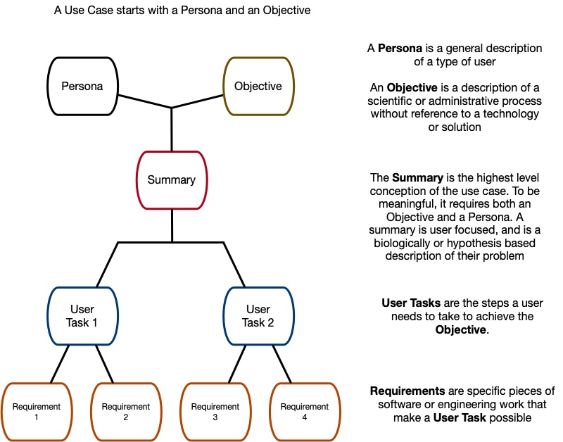

# Use Case Library Glossary

A **Use Case** consists of an **Objective** and a **Persona** -
a person who can have an **Objective**. These are combined into a **summary**
of specific use for the CFDE, which can be achieved by a series
of **user tasks**. Each **User Task** is single step in the users workflow.
The technical infrastucture required
to enable a **User Task** are it's **Requirements**. In most cases, what
appears to the user as a single step actually is a multistep process to the
computer doing the work, so any given **User Task** will likely have many **Requirements**.
Both **user tasks** and **requirements** can be shared across **Use Cases**

## Overview

## Definitions

### Objective

A description of a scientific process, told
without reference to a specific technology solution. Focuses on
resources required, method(s) followed, and outcome(s) targeted. Can
be validated with scientific stakeholders.

### Persona
A type of user who will appear in the epics and stories that follow.

### Summary
A high-level, non-technical description of an entire Use Case. The user in each summary has a name, a scientific or administrative problem, and both proximate and ultimate goals. The focus is on the problem and what is generally needed to solve it.

### User Task
A story, told from the user's perspective that captures a
concrete step in a users interactions with tools (e.g. software solutions) in
the service of achieving the scientific objective. Must be written in
terms that are meaningful to the user, from their
perspective. This can be thought of as one in a series of medium scale tasks
that must be completed to answer the question posed in the scientific objective.
The list of User Task in a Use Case should cover everything the user needs to
achieve their goal, even interactions that don't involve the software
or data from the Common Fund.

### Requirement
A well-scoped and defined piece of software or data engineering
work that is needed to support a User Task. These should be small tasks
that can be verified with engineering teams (Did we deliver it? Yes
or no.) A single requirement might be important for any number of different User
Tasks, and various collections of Requirements can be grouped to support
different User Tasks.
